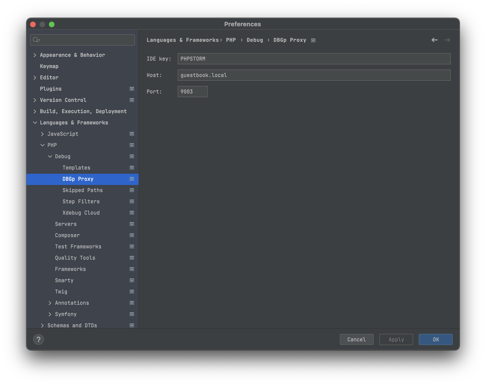
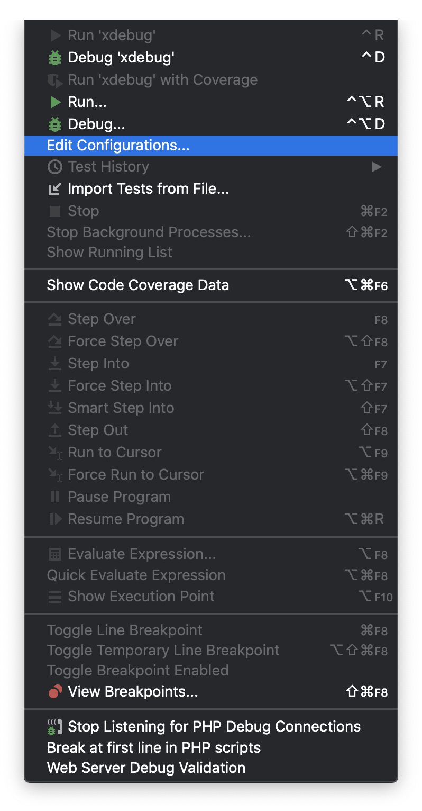

# Configuring xdebug
The steps bellow must be performed after deployment of local environment and launching containers
1. Open `Settings` (`Ctrl + Alt + S`) or `Preferences` (`⌘ + ,`)
2. Go to `Languages & Frameworks`, `PHP`, `Debug`
    
    - set value `9003` for `Debug port` field  
   (or another specific value due to `EXTERNAL_XDEBUG_PORT` in your `.env` file)
3. Go to `DBGp Proxy` there
    
    - set value `PHPSTORM` for `IDE key` field (or your specific value in [`xdebug.ini`](../../docker/php/conf/xdebug.ini))
    - set value `localhost` (or your specific domain) for `Host` field
    - set value `9003` for `Port` field  
      (or another specific value due to `EXTERNAL_XDEBUG_PORT` in your `.env` file)
4. Then go to `Servers` (one level higher in settings hierarchy -> `Languages & Frameworks`, `PHP`, `Servers`)
    
    - add new server with `+`
        - set value `docker-server` for `Name` field  
      (or your specific value due to `PHP_IDE_CONFIG` in your `.env` file)
        - set value `localhost` (or your specific domain) for `Host` field
        - set value `80` for `Port` field
        - map the path to your application to directory `/var/www/app` into container
5. Open `Edit Configuration…` in `Run` menu
    
6. Add new configuration with `+` , choose `PHP Remote Debug` template
    
    - name this config as you wish
    - choose created server (`docker-server`) for `Server` field
    - set value `PHPSTORM` for `IDE key (session id)` field
7. Set your real IP for `DOCKER_HOST_IP` variable in `.env` file
8. Restart your containers
    ```bash
   $ docker-compose down
   $ docker-compose up -d
    ```
9. Start Listening for PHP Debug Connections with
     -> 
    